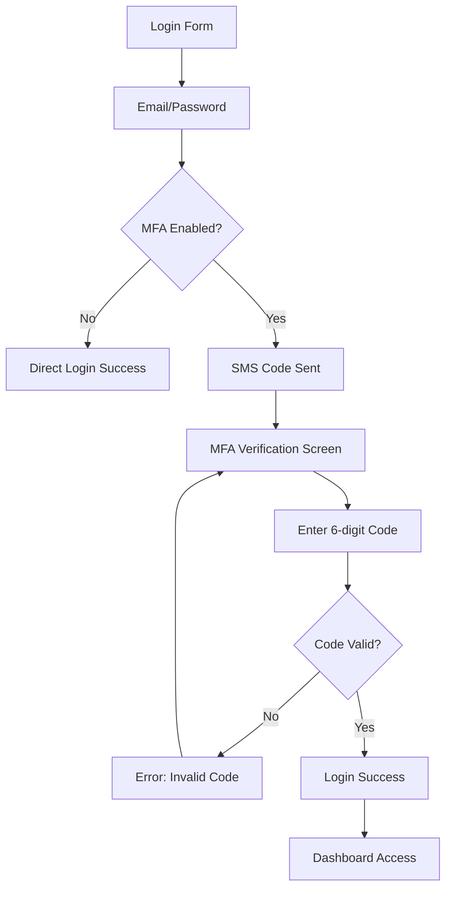

# 🔐 Multi-Factor Authentication (MFA) - Sistema Galáctico

## 📋 Visão Geral

O Sistema Galáctico agora possui autenticação multi-fator (MFA) integrada com AWS Cognito, fornecendo uma camada adicional de segurança para proteger contas de usuários através de códigos SMS.

## ✨ Funcionalidades Implementadas

### 🚀 **Backend (AWS Cognito MFA)**

#### **Endpoints da API**

| Método | Endpoint | Descrição | Autenticação |
|--------|----------|-----------|--------------|
| `POST` | `/api/auth/mfa/enable` | Habilitar MFA para usuário | ✅ Token JWT |
| `POST` | `/api/auth/mfa/disable` | Desabilitar MFA | ✅ Token JWT |
| `GET` | `/api/auth/mfa/status` | Verificar status do MFA | ✅ Token JWT |
| `POST` | `/api/auth/mfa/verify` | Verificar código MFA | ❌ Público |

#### **Controladores MFA**

- **`enableMfaController`**: Configura número de telefone e habilita MFA por SMS
- **`disableMfaController`**: Remove MFA da conta do usuário
- **`getMfaStatusController`**: Retorna status atual do MFA
- **`respondMfaChallengeController`**: Processa códigos MFA durante login

#### **Login com Suporte a MFA**

```json
// Resposta de login quando MFA é obrigatório
{
  "success": false,
  "requiresMfa": true,
  "challengeName": "SMS_MFA",
  "session": "session_token_aqui",
  "message": "Verificação MFA necessária. Código SMS foi enviado."
}
```

### 🎨 **Frontend (React Components)**

#### **Componentes Criados**

1. **`MfaSettings.jsx`** - Configuração de MFA
   - Habilitar/desabilitar MFA
   - Configurar número de telefone
   - Verificar status atual
   - Interface moderna com ícones Lucide

2. **`MfaVerification.jsx`** - Verificação durante login
   - Entrada de código de 6 dígitos
   - Interface responsiva
   - Botão de reenvio de código
   - Validação em tempo real

#### **Integração no Dashboard**

- Nova seção "MFA Security" no menu lateral
- Ícone Shield com gradiente vermelho-rosa
- Acesso direto às configurações de MFA

#### **Fluxo de Login Atualizado**

1. Usuário entra email/senha
2. Se MFA habilitado → Tela de verificação MFA
3. Código SMS → Verificação → Login completo
4. Se MFA desabilitado → Login direto

## 🔧 Como Usar

### **Para Administradores**

#### **1. Configuração do AWS Cognito**

Certifique-se de que as seguintes configurações estão no `.env`:

```env
COGNITO_USER_POOL_ID=sa-east-1_W9B5wyJDp
COGNITO_CLIENT_ID=seu_client_id
COGNITO_CLIENT_SECRET=seu_client_secret
AWS_REGION=sa-east-1
```

#### **2. Configurações do User Pool**

- **MFA**: Opcional ou Obrigatório
- **MFA Methods**: SMS
- **SMS Configuration**: Configurar SNS

### **Para Usuários**

#### **Habilitando MFA**

1. Faça login no sistema
2. Acesse "MFA Security" no menu lateral
3. Digite seu número de telefone (formato: +5511999999999)
4. Clique em "Habilitar MFA"
5. ✅ MFA ativado!

#### **Login com MFA**

1. Digite email e senha normalmente
2. Se MFA estiver ativo → Tela de verificação aparece
3. Digite o código de 6 dígitos recebido por SMS
4. Clique em "Verificar Código"
5. ✅ Acesso liberado!

#### **Desabilitando MFA**

1. No Dashboard → "MFA Security"
2. Clique em "Desabilitar MFA"
3. Confirme a ação
4. ⚠️ MFA removido (segurança reduzida)

## 🛡️ Segurança

### **Benefícios do MFA**

- **🔒 Proteção Adicional**: Mesmo com senha comprometida, acesso negado sem telefone
- **📱 SMS Verification**: Código temporário enviado para telefone verificado
- **⏰ Códigos Temporários**: Códigos expiram rapidamente
- **🚫 Força Bruta**: Proteção contra ataques automatizados

### **Tratamento de Erros**

```javascript
// Códigos de erro MFA
- CodeMismatchException: Código incorreto
- ExpiredCodeException: Código expirado
- TooManyRequestsException: Muitas tentativas
- InvalidParameterException: Parâmetros inválidos
```

## 🎯 Exemplos de Uso

### **Habilitar MFA (cURL)**

```bash
curl -X POST http://localhost:3000/api/auth/mfa/enable \
  -H "Authorization: Bearer YOUR_TOKEN" \
  -H "Content-Type: application/json" \
  -d '{"phoneNumber": "+5511999999999"}'
```

### **Verificar Status MFA**

```bash
curl -X GET http://localhost:3000/api/auth/mfa/status \
  -H "Authorization: Bearer YOUR_TOKEN"
```

### **Responder Desafio MFA**

```bash
curl -X POST http://localhost:3000/api/auth/mfa/verify \
  -H "Content-Type: application/json" \
  -d '{
    "session": "session_from_login",
    "mfaCode": "123456", 
    "username": "user@example.com"
  }'
```

## 🔄 Fluxo Completo



## 📱 Interface Visual

### **Tela de Configuração MFA**
- Card glassmorphism com bordas arredondadas
- Ícone Shield azul
- Status atual (Habilitado/Desabilitado)
- Campo de telefone com validação
- Botões com gradientes modernos

### **Tela de Verificação MFA**
- Background gradiente Star Wars
- Input centralizado para código
- Formatação automática (6 dígitos)
- Botões: Verificar, Voltar, Reenviar

## 🚨 Solução de Problemas

### **MFA não está funcionando**
1. Verifique configurações AWS SNS
2. Confirme User Pool settings
3. Teste com número de telefone válido
4. Verifique logs do servidor

### **Códigos SMS não chegam**
1. Verifique configuração SNS
2. Confirme número no formato internacional
3. Teste em sandbox mode primeiro
4. Verifique limites de SMS da AWS

### **Erro de autenticação**
1. Verifique tokens JWT
2. Confirme session válida
3. Teste endpoints manualmente
4. Verifique CORS settings

## 🎉 Status da Implementação

- ✅ **Backend MFA Controllers**
- ✅ **Frontend MFA Components** 
- ✅ **AWS Cognito Integration**
- ✅ **Login Flow Update**
- ✅ **Dashboard Integration**
- ✅ **Error Handling**
- ✅ **Responsive Design**
- ✅ **Security Validation**

## 📚 Próximos Passos

- [ ] **TOTP Support**: Google Authenticator
- [ ] **Backup Codes**: Códigos de recuperação
- [ ] **MFA Recovery**: Reset por admin
- [ ] **Analytics**: Logs de tentativas MFA
- [ ] **Rate Limiting**: Proteção contra spam

---

## 🌟 **MFA Implementado com Sucesso!**

O sistema agora possui proteção de nível empresarial com AWS Cognito MFA integrado. Sua galáxia está mais segura! 🚀🛡️